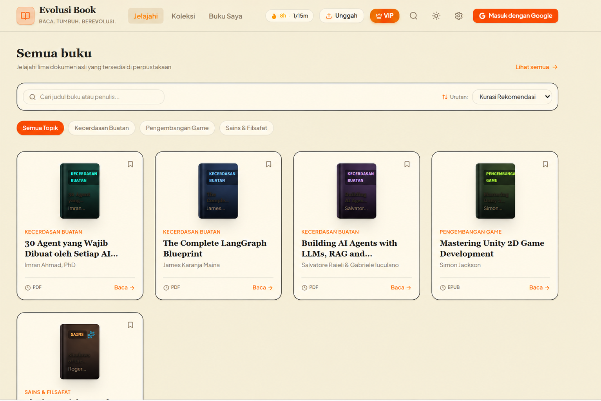

# Botdong Book

Botdong Book adalah aplikasi web berbahasa Indonesia untuk membaca intisari buku dalam sekitar 15 menit. Aplikasi ini menyediakan reader dengan highlight dan anotasi, AI Mentor Gemini, target serta streak membaca, pomodoro timer, lencana, community highlights, impor dokumen, dan ekspor ke Google Workspace.

## Pratinjau



## Teknologi

- React 19, TypeScript, Vite 8, dan Tailwind CSS 4
- Firebase Authentication dan Firestore untuk autentikasi serta sinkronisasi cloud
- Express untuk server produksi dan endpoint AI
- Google Gemini melalui `@google/genai` (server-side)
- `mammoth` dan `pdfjs-dist` untuk membaca DOCX dan PDF

## Prasyarat

- Node.js 22.12 atau lebih baru
- pnpm 9 (`npm install -g pnpm`)
- Proyek Firebase, bila ingin memakai login Google dan sinkronisasi cloud
- Gemini API key, bila ingin respons AI Mentor dari Gemini

## Menjalankan secara lokal

1. Instal dependensi.

   ```bash
   pnpm install
   ```

2. Salin contoh environment dan sesuaikan nilainya.

   ```powershell
   Copy-Item .env.example .env.local
   ```

   Pada macOS/Linux gunakan `cp .env.example .env.local`.

3. Isi `.env.local` sesuai kebutuhan.

   ```env
   GEMINI_API_KEY=your_gemini_api_key
   APP_URL=http://localhost:3000
   # Opsional: UID Firebase yang boleh mengelola katalog
   VITE_ADMIN_UIDS=uid_anda
   ```

   Jika `GEMINI_API_KEY` tidak disediakan, AI Mentor tetap berjalan memakai respons fallback. API key tidak dikirim ke browser.

4. Tambahkan konfigurasi klien Firebase sebagai `firebase-applet-config.json` di root proyek. File ini diperlukan oleh aplikasi dan tidak disertakan di repositori.

   ```json
   {
     "projectId": "your-project-id",
     "appId": "your-app-id",
     "apiKey": "your-firebase-web-api-key",
     "authDomain": "your-project.firebaseapp.com",
     "storageBucket": "your-project.firebasestorage.app",
     "messagingSenderId": "your-sender-id"
   }
   ```

5. Jalankan server pengembangan.

   ```bash
   pnpm dev
   ```

   Buka [http://localhost:3000](http://localhost:3000).

## Firebase

Untuk sinkronisasi dan Google Sign-In:

1. Aktifkan provider **Google** di Firebase Authentication.
2. Tambahkan `localhost` dan domain produksi pada **Authorized domains**.
3. Deploy aturan Firestore setelah memilih proyek Firebase yang benar.

   ```bash
   firebase deploy --only firestore:rules
   ```

Data pembaca dikelola secara local-first: aplikasi dapat digunakan tanpa login melalui penyimpanan lokal; login Google mengaktifkan sinkronisasi Firestore antar-perangkat. Aturan pada [`firestore.rules`](firestore.rules) membatasi data pengguna ke pemiliknya dan katalog ke admin.

Buku lengkap menggunakan IndexedDB dengan koleksi per akun; backup membawa gambar. Untuk cloud gambar, deploy [`storage.rules`](storage.rules) dan atur CORS bucket. VIP mengikuti entitlement dari server/admin; checkout simulasi telah dinonaktifkan. Lihat [panduan migrasi, deployment, dan batas reader](docs/reader-reliability.md).

## Perintah

| Perintah | Keterangan |
| --- | --- |
| `pnpm dev` | Menjalankan Vite di port 3000 dengan HMR dan endpoint AI untuk pengembangan. |
| `pnpm build` | Membuat build produksi ke `dist/`. |
| `pnpm start` | Menjalankan Express di port 3000 untuk menyajikan `dist/` dan endpoint AI. Jalankan `pnpm build` terlebih dahulu. |
| `pnpm preview` | Mempratinjau hasil build Vite. |
| `pnpm typecheck` | Memeriksa tipe TypeScript tanpa membuat output. |
| `pnpm lint` | Menjalankan ESLint. |
| `pnpm test` | Menjalankan test Vitest sekali. |
| `pnpm check` | Menjalankan typecheck, lint, lalu test. |

## Struktur proyek

```text
src/
├── components/     # Tampilan dan fitur UI
├── context/        # State aplikasi dan preferensi tema
├── data/           # Katalog buku bawaan
├── lib/            # Firebase dan integrasi Google Workspace
├── server/         # Gemini, validasi permintaan, dan rate limit
├── utils/          # Parser dokumen, tujuan baca, badge, dan notifikasi
└── types/          # Tipe TypeScript bersama
server.ts           # Server Express untuk produksi
vite.config.ts      # Konfigurasi Vite dan endpoint AI saat development
firestore.rules     # Aturan akses Firestore
```

## Fitur

- Reader dengan progres per bab, highlight, anotasi, dan kustomisasi tema
- AI Mentor berbasis Gemini melalui `POST /api/gemini/mentor`
- Target membaca, jurnal, streak, lencana, dan pomodoro timer
- Login Google serta sinkronisasi real-time dengan Firestore
- Community shared highlights dan like
- Impor buku PDF, DOCX, EPUB, TXT, dan Markdown
- Ekspor anotasi ke Google Docs, Sheets, Gmail, dan Chat
- Katalog buku dan pengelolaan katalog berbasis peran admin

## Keamanan

Panggilan Gemini selalu diproses di server menggunakan `GEMINI_API_KEY`; jangan memakai variabel `VITE_` untuk secret. Firebase web API key memang tersedia di konfigurasi klien, tetapi akses data harus tetap dilindungi oleh Firebase Authentication dan aturan Firestore.

## Kontribusi

Gunakan pnpm agar lockfile proyek tetap konsisten. Sebelum mengirim perubahan, jalankan:

```bash
pnpm check
```

## Lisensi

Belum ada berkas lisensi di repositori ini.
